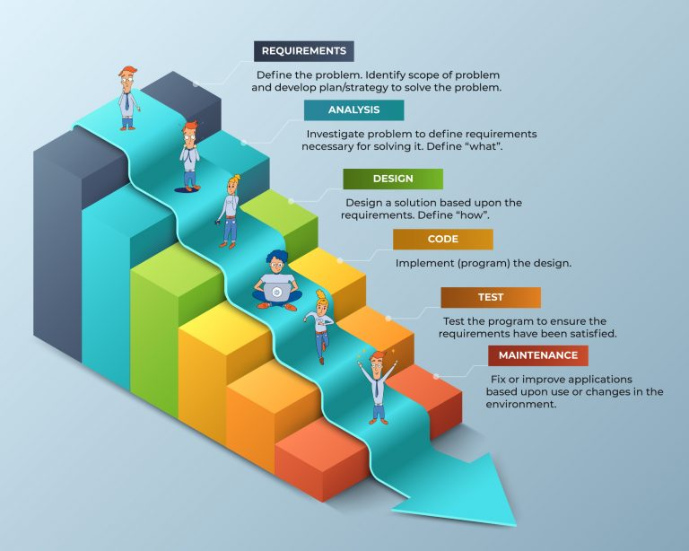
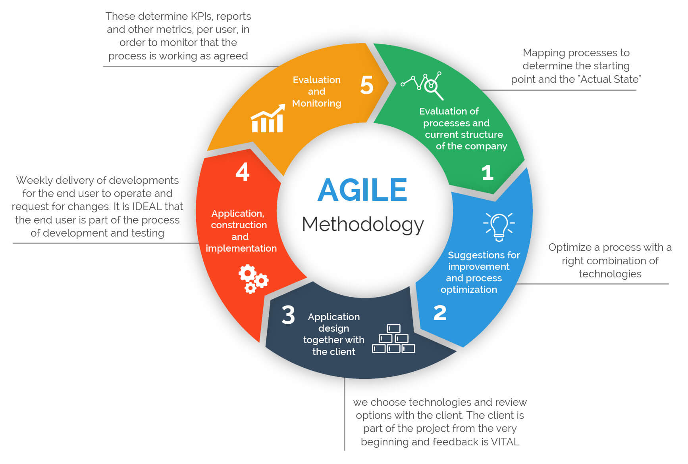
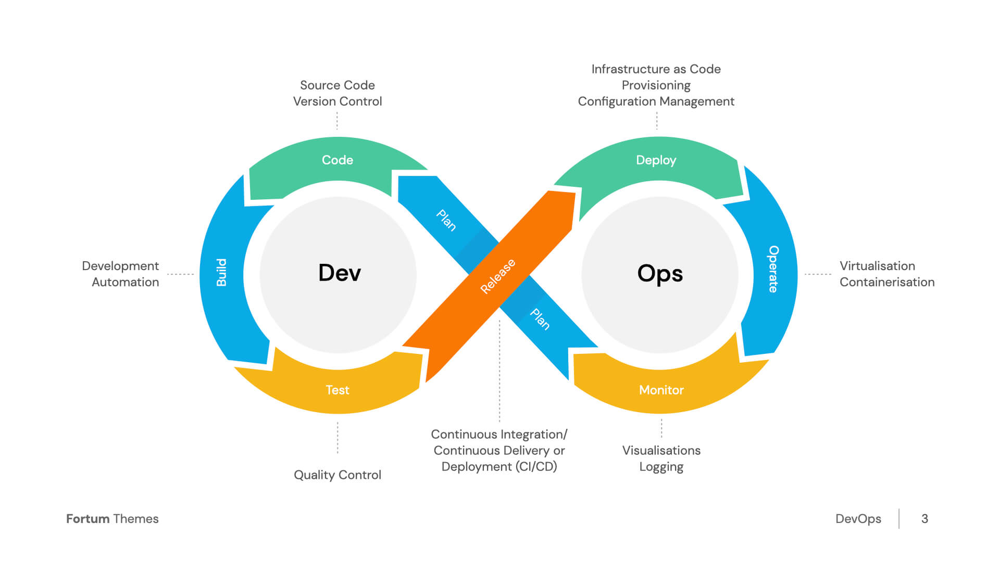

# 📘 Software Development Methodologies: Waterfall, Agile, and DevOps

---

## 🌊 1. Waterfall Model

### 🔹 Explanation
Waterfall is a **linear and sequential** approach to software development. Each phase must be completed before moving to the next. It is best suited for projects with **clearly defined and unchanging requirements**.



### 🔁 Workflow
```
1. Requirements → 
2. Design → 
3. Implementation → 
4. Testing → 
5. Deployment → 
6. Maintenance
```

### ✅ Advantages
- Easy to understand and manage.
- Clear documentation and milestones.
- Well-structured approach for small, predictable projects.

### ❌ Disadvantages
- Inflexible to changes after the process starts.
- Late testing phase leads to delayed bug detection.
- Not suitable for complex or evolving projects.

---

## ⚡ 2. Agile Methodology

### 🔹 Explanation
Agile is an **iterative and incremental** methodology. It emphasizes **collaboration**, **customer feedback**, and the delivery of working software in **short cycles** (sprints).



### 🔁 Workflow (Scrum-style)
```
1. Product Backlog → 
2. Sprint Planning → 
3. Sprint (1–4 weeks):
     - Design
     - Develop
     - Test
4. Daily Standups → 
5. Sprint Review → 
6. Sprint Retrospective → 
7. Repeat (next Sprint)
```

> Each **Sprint** produces a working feature or improvement.

### ✅ Advantages
- Flexible and adaptable to changes.
- Continuous customer feedback improves quality.
- Faster time-to-market with small, usable increments.
- Early issue detection due to frequent testing.

### ❌ Disadvantages
- Requires experienced teams and active collaboration.
- Can be hard to define scope and deadlines up front.
- Risk of scope creep without strong controls.

---

## 🚀 3. DevOps Approach

### 🔹 Explanation
DevOps is a **culture and set of practices** that unify software development (Dev) and operations (Ops). It enables **automation**, **continuous integration**, **continuous delivery**, and close collaboration across teams.



### 🔁 Workflow (CI/CD Pipeline)
```
1. Plan → 
2. Develop → 
3. Build → 
4. Test → 
5. Release → 
6. Deploy → 
7. Operate → 
8. Monitor → 
9. Feedback → Plan
```

> DevOps supports **automation**, **monitoring**, and **rapid delivery** throughout the lifecycle.

### ✅ Advantages
- Faster, more reliable software delivery.
- Automation reduces errors and manual tasks.
- Real-time monitoring and continuous feedback.
- Encourages team collaboration and shared ownership.

### ❌ Disadvantages
- Initial setup can be complex and tool-heavy.
- Cultural shift required for successful implementation.
- Needs integrated security (DevSecOps) to avoid vulnerabilities.

---

## 📊 Comparison Table

| Feature              | Waterfall              | Agile                     | DevOps                        |
|----------------------|------------------------|----------------------------|-------------------------------|
| Approach             | Linear & Sequential    | Iterative & Incremental    | Continuous & Collaborative    |
| Flexibility          | Low                    | High                       | High                          |
| Testing              | At the end             | During every sprint        | Automated & Continuous        |
| Delivery             | One-time               | Frequent (each sprint)     | Continuous (CD)               |
| Customer Involvement | Minimal                | High                       | Moderate to High              |
| Tools                | MS Project, Excel      | Jira, Trello               | Jenkins, Docker, Ansible, Git |
| Best For             | Fixed-scope projects   | Evolving requirements      | Fast, scalable environments   |

## 📐 Phase-by-Phase Comparison Table

| Phase              | Waterfall                          | Agile                                   | DevOps                                      |
|--------------------|-------------------------------------|------------------------------------------|---------------------------------------------|
| **Requirement**     | Collected once at the beginning     | Continuously evolving via backlog        | Same as Agile; driven by user feedback loop |
| **Design**          | Done completely before development  | High-level upfront, refined in sprints   | Continuous architectural planning           |
| **Development**     | Starts after design is frozen       | Iterative within each sprint             | Continuous coding and merging (CI)          |
| **Testing**         | Happens after development completes | Happens during each sprint               | Automated and continuous (CI/CD)            |
| **Release**         | Single release after full testing   | Incremental releases per sprint          | Frequent or on-demand via pipelines         |
| **Deployment**      | Manual, at end of project           | At end of each sprint (can be automated) | Automated and often multiple times daily    |
| **Operations**      | Post-deployment only (maintenance)  | Minimal visibility during sprint         | Continuous monitoring & logging             |
| **Feedback Loop**   | Very limited or late-stage          | Present after each sprint                | Instant, real-time from production          |
| **Change Handling** | Difficult once process starts       | Embraced and adaptive                    | Built-in through automation and tools       |

